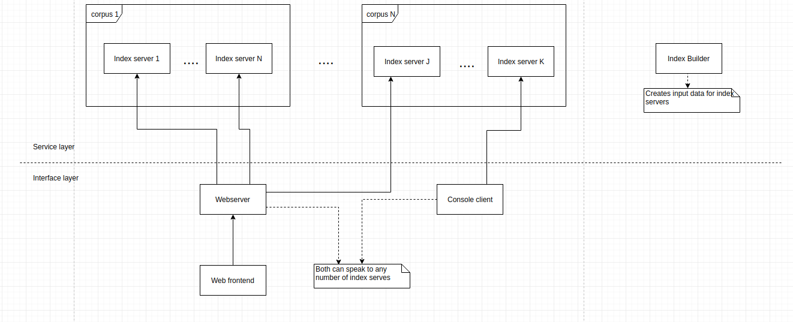
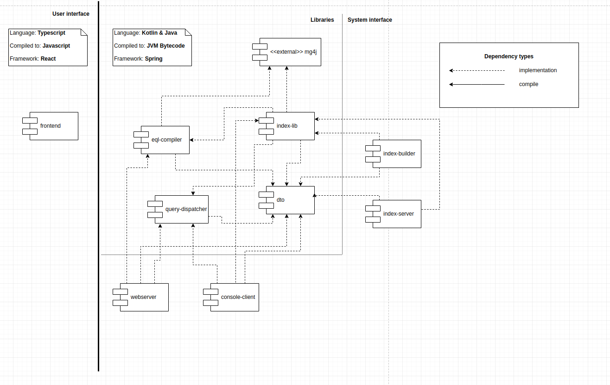

#  ENTICING - Entities in Context Interface (New Generation) 
master [](https://circleci.com/gh/d-kozak/enticing/tree/master)
release [](https://circleci.com/gh/d-kozak/enticing/tree/release)

App deployed at [enticing.herokuapp.com](https://enticing.herokuapp.com/)

All source code related to the Enticing project. 

## Components
Main components of the system can be seen on the following diagram.

* Web frontend
    * web interface of the search engine
* Webserver
    * handles the web frontend
* Console client
    * To query index servers from the command line
* Index server
    * processes EQL queries, on it's indexed data
* Index builder
    * prepares indexes for index servers


## Modules
The whole repository is a gradle multi-project consisting of the following submodules.

Responsibilities of each module are the following.
* frontend
    * GUI for the webserver 
* webserver
    * user authentication
    * query submission
    * search settings
    * user management
* console client
    * query submission from the command line
* query processor
    * execute query on multiple index servers 
    * query validation(using eql-compiler)
* eql-compiler
    * compile EQL to mg4j
    * query validation
* dto
    * define data transfer objects used between query processor and index servers
* index-common
    * index data using mg4j
    * query indexed data
* index-server
    * handle queries using index-common
* index-builder
    * index data using index-common


## Build
### Webserver & frontend
Production build
```
gradle stage
```
Run locally
```
gradle bootRun
```

## Test
Execute all tests
```
gradle test --info
```

## Authors
* [d-kozak](https://github.com/d-kozak/)
    * contact: [dkozak94@gmail.com](mailto:dkozak94@gmail.com)
