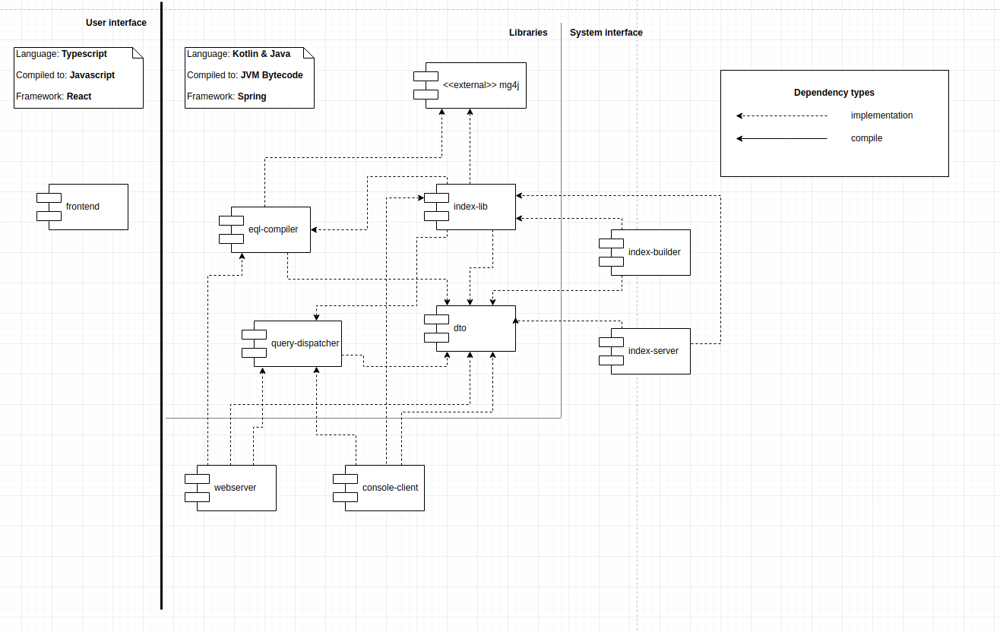

# Architecture
This document describes the architecture of the enticing platform.
## Components
Main components of the system can be seen on the following diagram.

* Web frontend
    * web interface of the search engine
* WebServer
    * handles the web frontend
    * provides user authentication
    * maintains a database with search configurations
* ConsoleClient
    * Queries index servers from the command line
* IndexServer
    * processes EQL queries on it's indexed data
    * returns CorpusFormat, SearchResults, ContextExtensions or FullDocuments
* IndexBuilder
    * prepares indexes from mg4j files for IndexServers

## Modules
The whole repository is a gradle multi-module project consisting of the submodules shown in the following diagram.

Responsibilities of each module are the following.
* frontend
    * GUI for the webserver 
* webserver
    * user authentication
    * query submission
    * search settings
    * user management
    * validations and intellisence for search input in the frontend
* console client
    * handle queries from the command line
* query-dispatcher
    * dispatch queries to multiple nodes, split wanted amounts of results evenly
* eql-compiler
    * compile EQL to mg4j
    * semantic validations
    * postprocessing
* dto
    * data transfer objects used for communication between components 
    * domain objects used in all modules
    * configuration DSLs for all modules
* index-lib
    * index mg4j files using mg4j
    * query indexed data
    * transform results into serializable text formats described [here](text_format.md) 
* index-server
    * provide REST API used by webserver and console client
    * internally uses index-lib to handle queries
* index-builder
    * index data using index-lib
