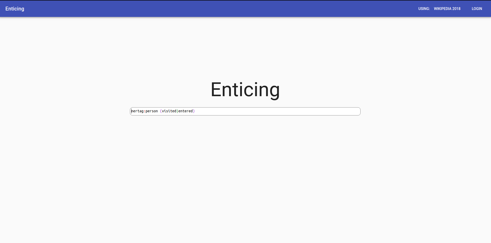
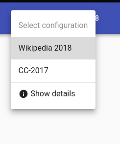
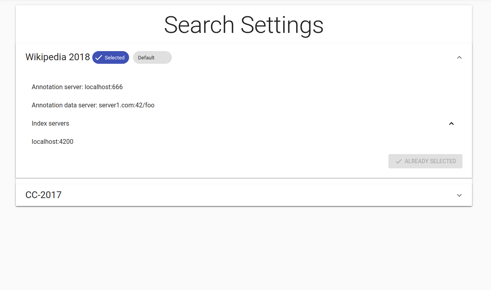
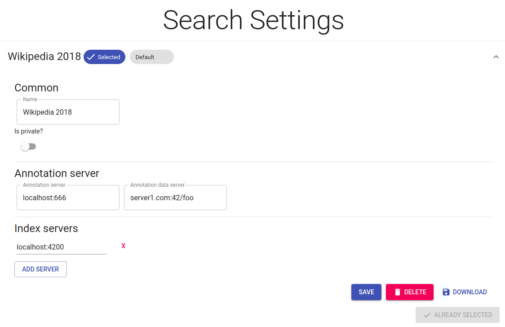
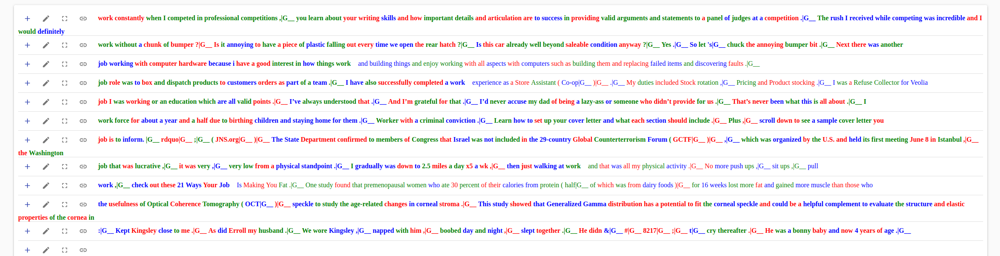

# Frontend updates

## Metadata format
Index-server is now able to return specific subset of meta information, but current frontend does not offer a way to select what information we want.
Currently, **all**  metadata is returned. 

For selecting which indexes, entities and attributes to include, I suggest TreeView, for example [this one](https://azizali.github.io/react-super-treeview/examples/#check-children)

Currently, main page looks like this.

I suggest adding the option to select indexes into the toolbar for selecting search configurations. It could be included there as another option.

Than the selector could be either a new page or it could be included into existing SearchSettingsSelector.

## Change SearchSettings format
Current SearchSettings is the following.

However, I am not sure whether it is necessary to include Annotation server details into the SearchSettings configuration.
It only makes sense assuming that there will be multiple instances of Annotation server. If this is not the case and there will be only one annotation server,
then I suggest refactoring it out of SearchSettings into new GlobalSettings that are applicable across SearchSettings.
Also I suggest adding an indicator telling the availability of index servers. Frontend could periodically ask webserver check if the index servers are running and this information could be shown here in SearchSettings.

## Annotation delay
Currently, way too many annotations open at once when mouse hovers over text. Two solutions I can think of right now:
1) add delay before opening the annotation, it will only open if the mouse is still hovering over it after the delay
2) ensure that only one annotation can be open at any time 

## Annotation colors
Currently every annotated element is colored. This looks nice for scenarios with a few annotations. However, it gets ugly once 
there are annotations for every word, which will actually be quite common. What about coloring only entities and keeping the words in default color?
