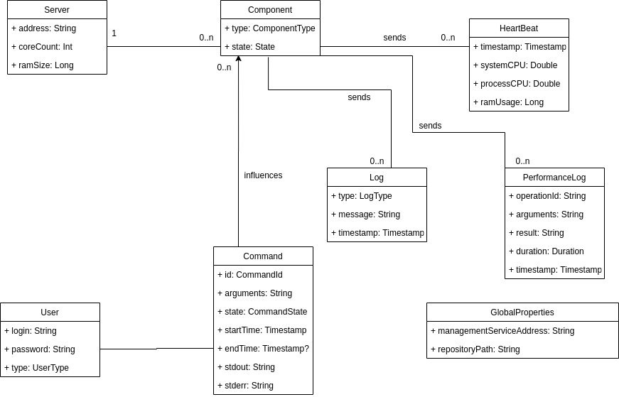

# Management system for Enticing
In the beginning, all components from enticing were started using their own specialized script. And on top of that,
for each deployment configuration, new scripts were created. This of course did not scale very well, therefore 
a management module based on scripts in Python was created. This module absorbed some of the functionality, 
but it internally still relies on some of the old scripts. Over the time of the development of the platform, it 
became clear that a better management system would be beneficial. This module could be
written as another kotlin module instead of a bunch of python scripts.

## Motivation
* reuse existing dto classes and business logic in the management service whenever necessary
* robust system with automated testing from the CI
* it's commands can be used in integration and performance tests for starting and killing tested components
* "One configuration rules them all" - there could be only one configuration DSL used by all components
* The scripts are not that big, so the reimplementation should be reasonably fast
* Possibility to run this app as a deamon in the backgroud which can perform heartbeat and other monitoring thigs
* This component could also aggregate most important logs(failures and serious problems) from all components and present it to the user in the 
most compact way

## Design

### Informal specification

**bold** for functionality requirements

_italics_ for domain specific entities

_Enticing management service_ (further referred to just as _service_) manages other _components_ of the platform and _commands_ necessary for its operation such as 
_file distribution_ and _indexing_. This is an internal system that should **not** be **accessible** to normal _users_, only to _platform_maintainers_ and _administrators_. 

Since its commands directly affect the health of other components, **user authentication** is **required**. **No data** should be accessible **without 
logging in**. Basic _platform maintainers_ should be able to *view* the **state of the system**, but **only** _admin users_ should be able to **execute** any _command_. 
To detect malicious behaviour, all executed _commands_ will be **persisted** to a database with the login of the _user_ who submitted them. The **output** of 
these commands will also be **persisted**, so that their execution can be traced if necessary. 

The list of supported _commands_ can **change** over time, but **not** so **frequently**, therefore it is **not necessary** to add **generic support**, they can be 
**hardwired**, but with **extensibility** in mind. For each submitted _command_, page with **details** about its state and its *output* should be visible. They should also 
be **cancellable**, when still in the _running_ state. 

The _service_ handles a set of _servers_ and allows _users_ to manage _components_ running on them. When new _server_ is being added, the **system** should check that the 
given **server** is really **accessible** using ssh. Similar **semantic validation** should be performed **whenever possible** to avoid mistakes early on. To ease the task of 
administration, _components_ should **register** themselves **on startup**. Also, they should **periodically send** _heartbeats_. These _heartbeats_ will **include** the current 
**state** of the _server_, which can be used to measure the performance and detect any bottlenecks.

Upon login, the _user_ should see a list of _servers_ along with their _components_. Each item should somehow **visualize its state** (green okay, orange for danger, 
red for serious problems). Each item should be '**clickable**' and cause a **redirection to** the page with more **details**, including _last logs_ and _heartbeats_.
Since the amount of _logs_ is huge, there should be some **filtering options** available. Apart from normal _logs_, **performance** of critical _operations_ should 
be **measured**. The _user_ should be able to **view aggregated list** of measured _operations_ and their _statistics_ and for **each** of them, **detailed** _logs_ 
should be **accessible**.

The _user_ should be able to **manage** these _components_ **easily**. There should be an option to **restart** each individual _component_ or the _whole system_.
Also, each _server_ should have a **button** for **adding** new _components_.

Apart from _monitoring_, the server should also support the _CI_ and _CD_. There should be an option to **pull** the newest version of the **code**, 
**build it**, **execute tests** and, if everything works, **deploy the platform**. Internally, these can be represented just like any other _command_, but in the **GUI**,
there should be a **separate section** for them, since they are independent of the other _tasks_.

### Rest interface
Endpoints - all with prefix /api/v1

DTOs are defined as data classes in the following [package](../management-service/src/main/kotlin/cz/vutbr/fit/knot/enticing/management/managementservice/dto/).

All GET request returning lists will support pagination using parameters _page_ and _size_.

* /login, /logout - as expected
* /user 
  * GET - current user info
  * /{login}
    * PUT - update user data
    * POST - register new user
    * DELETE - delete user
    
* /server
    * GET - list of servers
    * POST - add new server
    * /{server-id} 
        * GET - get details of given server
        * DELETE - remove server - only possible if no known components are running there
        * /stats
            * GET - last server statistics (ram and CPU)
        * /component
            * GET - list of components running on this server
            * POST - start new component (or restart a dead one) **TODO**
                           
* /heartbeat
    * POST - for receiving heartbeats from components  
* /component
    * GET - list of known components
        * param _component_type_ - only of specified component type (index-server,...)
    * /{component-id}
        * GET - details of this component
        * DELETE - shutdown given component and remove it **TODO**                 
* /log 
    * GET - get logs from all components
        * param _level_ - only given level or higher
        * param _component_type_ - only of specified component type (index-server,...)
    * POST - submit a new log
    * /{component-id} - logs of given component 
                      
* /perf - performance info
    * GET - perf logs 
        * param _operation_id_ - only logs for given operation
    * /stats
        * GET - list of measured operations with aggregated values (min, max, avg)
        * param _operation_id_ - only stats for given operation
       
* /command **TODO**
    * GET - list of executed commands
        * param _type_ - only commands of given type
        * param _state_ - only commands with given state (running,finished,failed)
        * param _user_ - only commands of specified user
    * POST - submit a new command
    
    