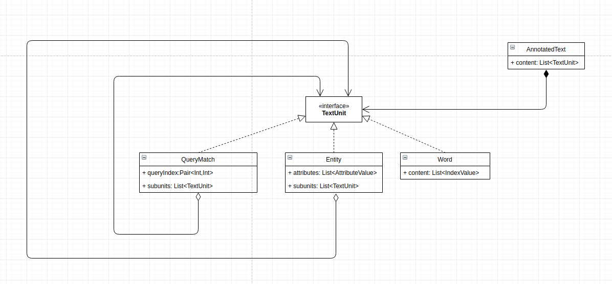
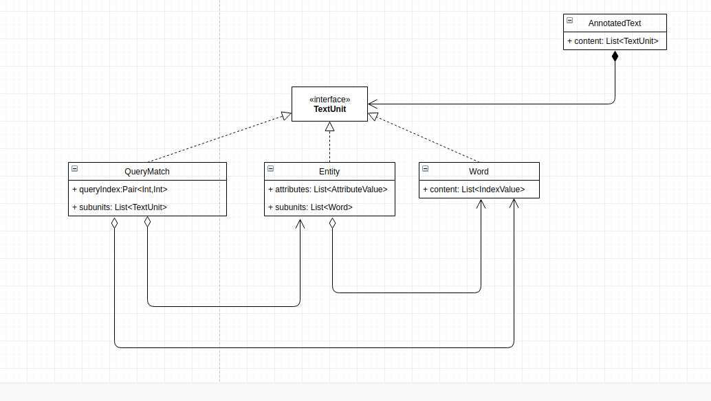

# New data data structure for annotated text

When we look at the mg4j format, we can notice two things.

1) Words are the atomic unit of mg4j files. Words cannot be split into anything smaller and all the indexes are bound to at least one word. Therefore annotated word is the atomic unit of these files. 

2) Entities may overlap sometimes, but current implementation in the backend does not allow that. ? Can entities overlap? I remember that the annotation server supports that, but the mg4j format does not allow all forms of overlaping (for example two entities cannot start on the same word)  ?  

The data structure we use to send the text from backend to frontend can utilize that.
Assuming entities cannot overlap, we can use the following structure. 

First version is more generic, allowing for arbitrary nesting, while the second is more restrictive, allowing units to only have "simpler" units as children.

Advantages of this data structure.
* It is similar to the format which is used on the index servers, so serialization would become much simpler.
* Does not need so much preprocessing on the client side.
* Easy to visualize and in general, all operations we currently care about are easier on this model
* Indexing is more straightforward ( no need to take into account length of words on the default index.