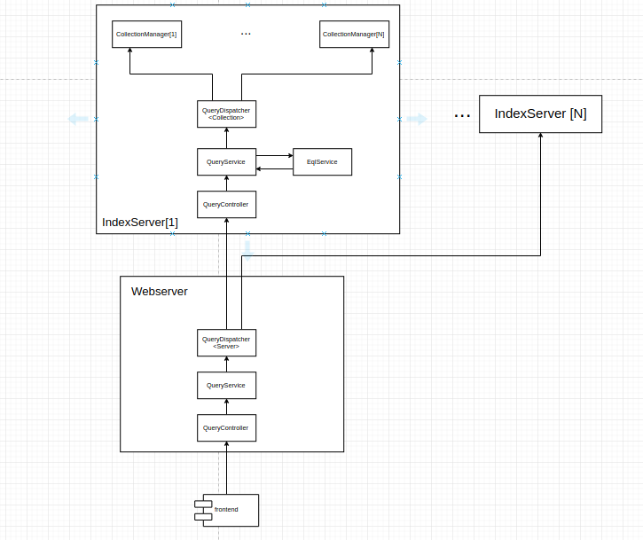
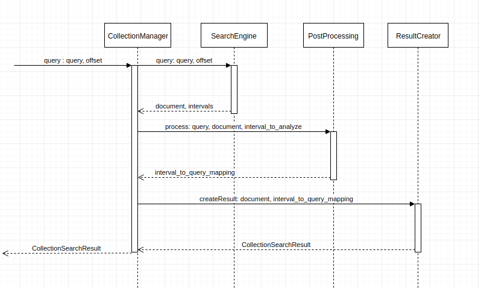

# Query Processing
This document describes the processing of a search query from the webserver. First, the flow of the query through the system is discussed. Then the backend part that actually processes the query and produces a result is described in more details.

## Flow of the query through the system
The general flow of query through the system can be seen on the following diagram.

Requests come from the frontend and are processed by the webserver first. They go through QueryController to QueryService, which dispatches the requests using the QueryDispatcher to a group of IndexServers. Inside IndexServers, the requests again go through QueryController and QueryService. QueryService calls EqlParser which validates the query and creates an AST that is passed further instead of string query. After the parsing, QueryDispatcher is used again to call all collections that given IndexServer handles. Each collection is managed by a CollectionManager, which performs the actual processing.

## Collection Manager
CollectionManager is the component that manages one collection and orchestrates all the necessary tasks to process a query and create a response. Processing of one query can be seen on the following diagram.

To perform a search, CollectionManager is called with a query and an offset. Query is already an AST at this point. The offset consists of two numbers, document index and result index. First, the CollectionManager calls SearchEngine which returns a list of documents that matched the query along with information which indexes were matched and how. SearchEngine uses the first part of the offset to skip documents that have already been used before. SearchEngine is also the only part that directly interacts with Mg4j. 

Because EQL provides features such as global constraints that cannot be directly implemented using mg4j, it is necessary to perform postprocessing. Postprocessing computes how the query matched the document on the level of individual parts of the query. Then additional checks such as global constraints are made which potentially filter out some of the results.

After the postprocessing finishes, all the necessary information to create SearchResults is available. Therefore the ResultCreator is called and CollectionSearchResult is created.

However, the ResultCreator deserves more discussion. IndexServers support multiple ResultFormats and TextFormats and a different result creation algorithm is used based on what was requested. More on the topic of how actual SearchResults are selected based on matched intervals and wanted ResponseFormat can be found [here](./result_format.md).
The second part of the offset is used in ResultCreator to skip already used SearchResults. 

