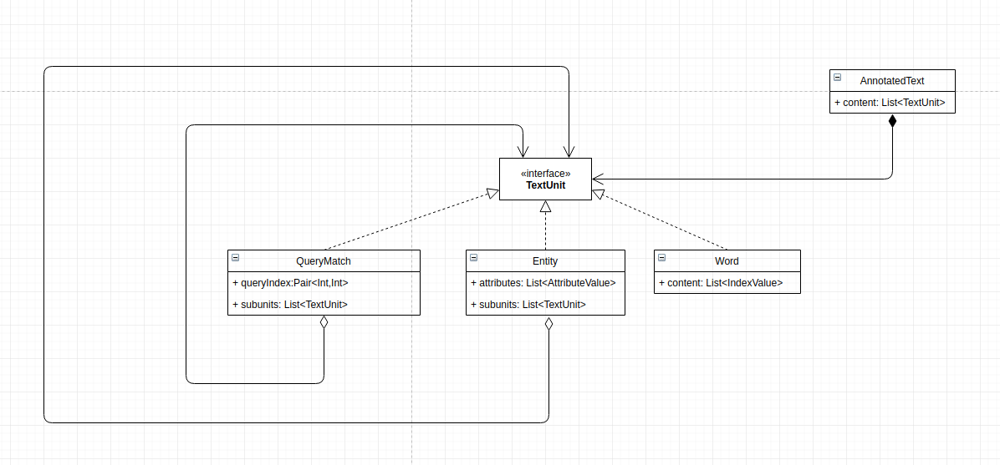
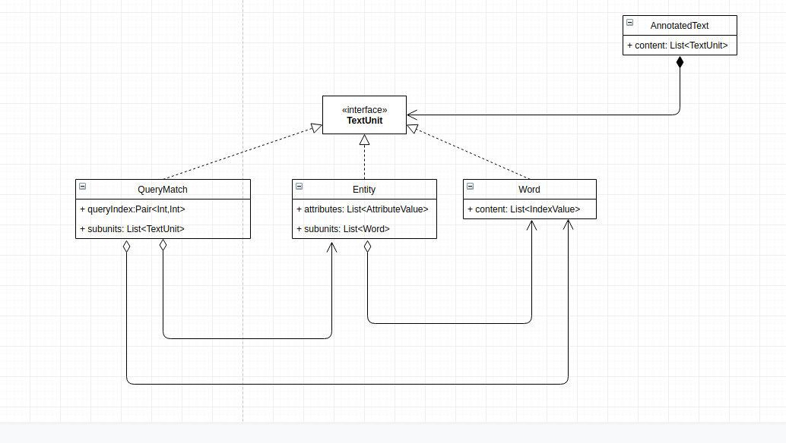

# Text format

This document describes formats for annotated text that the index-server supports (or will support in the future).

## Plain text
This format only returns the text from the default index as a single string without any metadata. It is meant to be used in situations when only a simple answer from a single index is needed.
In such case using the new annotated text has unnecessary overhead.

## HTML
In this format, the response is a single string containing html. Since the exact details of this format were not discussed yet, only a simple prototype has been implemented, but nevertheless it has already proofed itself useful for debugging.
Each word is a \<span> tag with attribute **eql-word**, each of the metadadata is included as attribute with eql- prefix, e.g. eql-lemma. Each entity is also a \<span> tag, but with attribute **eql-entity** instead. 
The matched region is denoted using a \<b> tag.

```html
<b>
    <span eql-word eql-position="10" eql-tag="NN" eql-lemma="job" eql-parpos="12" eql-function="NMOD"
          eql-parwrod="expertise" eql-parlemma="expertise" eql-paroffset="+2" eql-link="0" eql-length="0" eql-docuri="0"
          eql-lower="job" eql-nerid="0" eql-nertag="0" eql-param0="0" eql-param1="0" eql-param2="0" eql-param3="0"
          eql-param4="0" eql-param5="0" eql-param6="0" eql-param7="0" eql-param8="0" eql-param9="0" eql-nertype="0"
          eql-nerlength="0">
        job
    </span>
</b>
<span eql-word eql-position="11" eql-tag="VVZ" eql-lemma="require" eql-parpos="10" eql-function="SUFFIX"
      eql-parwrod="job"
      eql-parlemma="job" eql-paroffset="-1" eql-link="0" eql-length="0" eql-docuri="0" eql-lower="requires"
      eql-nerid="0" eql-nertag="0"
      eql-param0="0" eql-param1="0" eql-param2="0" eql-param3="0" eql-param4="0" eql-param5="0" eql-param6="0"
      eql-param7="0"
      eql-param8="0" eql-param9="0" eql-nertype="0" eql-nerlength="0">
    requires
</span> 
```

## StringWithMetadata
In this format, the text from default index is sent as a string and the metadata are intervals over this string.
It is represented using the [following classes](../dto/src/main/kotlin/cz/vutbr/fit/knot/enticing/dto/AnnotatedText.kt).
Though it is not that hard to generate, it requires quite a lot of processing on the frontend before it can be rendered. 
Also it has unnecessary overhead, because it is not necessary to sent the name for each index in each annotation.
```javascript
const oldFormatExample = {
    "content": {
        "text": "job requires expertise in intelligence work .|G__ Is the national security adviser a policy wonk or an operative who gets into the thick of things while giving his president objective policy advice on issues affecting the security of the State ?|G__ Is a president well-served by having a national security adviser",
        "annotations": {
            "w-0": {
                "id": "w-0",
                "content": {
                    "position": "10",
                    "tag": "NN",
                    "lemma": "job",
                    "parpos": "12",
                    "function": "NMOD",
                    "parwrod": "expertise",
                    "parlemma": "expertise",
                    "paroffset": "+2",
                    "link": "0",
                    "length": "0",
                    "docuri": "0",
                    "lower": "job",
                    "nerid": "0",
                    "nertag": "0",
                    "param0": "0",
                    "param1": "0",
                    "param2": "0",
                    "param3": "0",
                    "param4": "0",
                    "param5": "0",
                    "param6": "0",
                    "param7": "0",
                    "param8": "0",
                    "param9": "0",
                    "nertype": "0",
                    "nerlength": "0"
                }
            }
        },
        "positions": [{
            "annotationId": "w-0",
            "match": {"from": 0, "size": 3},
            "subAnnotations": []
        }],
        "queryMapping": [{"textIndex": {"from": 0, "size": 3}, "queryIndex": {"from": 0, "size": 1}}]
    }
}
```

## TextUnitList
This format was developed while trying to fix some of the issues of the old format.
 
When we look at the mg4j format, we can notice two things.

1) Words are the atomic unit of mg4j files. Words cannot be split into anything smaller and all the indexes are bound to at least one word. Therefore annotated word is the atomic unit of these files. 

2) The mg4j format does not allow arbitrary overlapping of entities. Each entity should end before a new one starts.     

When taking into account the previously mentioned observations, we can use the following structure. 

First version is more generic, allowing for arbitrary nesting, while the second is more restrictive, allowing units to only have "simpler" units as children.

It is represented using the [following classes](../dto/src/main/kotlin/cz/vutbr/fit/knot/enticing/dto/NewAnnotatedText.kt).

```javascript
const newFormatExample = {
    "content": [
        {
            "content": [{
                "type": "word",
                "indexes": ["15", "work", "NN", "work", "13", "PMOD", "outside", "outside", "-2", "0", "0", "0", "work", "0", "0", "0", "0", "0", "0", "0", "0", "0", "0", "0", "0", "0", "0"]
            }, {
                "type": "word",
                "indexes": ["16", ",|G__", ",", ",", "8", "P", "grip", "grip", "-8", "0", "0", "0", ",", "0", "0", "0", "0", "0", "0", "0", "0", "0", "0", "0", "0", "0", "0"]
            }, {
                "type": "word",
                "indexes": ["17", "like", "IN", "like", "8", "NMOD", "grip", "grip", "-9", "0", "0", "0", "like", "0", "0", "0", "0", "0", "0", "0", "0", "0", "0", "0", "0", "0", "0"]
            }, {
                "type": "word",
                "indexes": ["18", "skinning", "VVG", "skin", "8", "SUFFIX", "grip", "grip", "-10", "0", "0", "0", "skinning", "0", "0", "0", "0", "0", "0", "0", "0", "0", "0", "0", "0", "0", "0"]
            }],
            "type": "queryMatch",
            "queryMatch": {"from": 0, "to": 1}
        }]
}
```

Advantages of this data format
* It is similar to the format which is used on the index servers internally, so serialization would become much simpler.
* Does not need so much preprocessing on the client side.
* Easy to render
* Indexing is more straightforward ( no need to take into account length of words on the default index.
* Smaller payload due to the fact that the semantics of the data is defined separately in the corpus format.


Disadvantages
* It requires more processing in the backend.

 